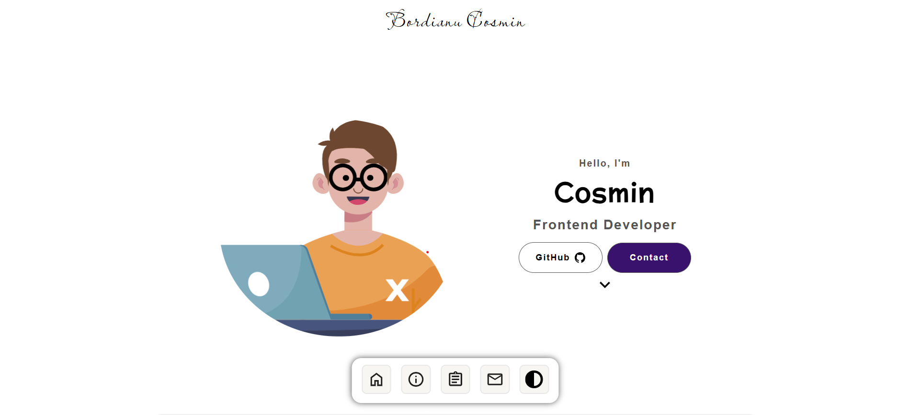

# Personal Portfolio

## Table of contents

- [Overview](#overview)
  - [Screenshot](#screenshot)
  - [Links](#links)
- [My process](#my-process)
  - [Built with](#built-with)
  - [What I learned](#what-i-learned)

## Overview

### Screenshot



### Links

- Live Site URL: [click](https://bordianu-cosmin.netlify.app/)

## My process

### Built with

- Semantic HTML5 markup
- JavaScript
- SCSS
- CSS Flexbox
- CSS Grid
- Mobile-first workflow

### What I learned

- using window.watchMedia() to detect input method

```js
const pointerMediaQuery = window.matchMedia("(pointer: fine)");
```

- simple email validation using regex

```js
const validateEmail = (email) => {
  const regex = /^[\w-\.]+@([\w-]+\.)+[\w-]{2,4}$/;
  return regex.test(email);
};
```

- declaring a font with @font-face

```css
@font-face {
  font-family: "Poppins";
  font-weight: 400;
  src: url("/assets/fonts/poppins-regular.woff2") format("woff2"), url("/assets/fonts/poppins-regular.woff")
      format("woff");
}
```

- using SCSS mixins and variables

```scss
$breakpoints-up: (
  "mobile": em(375),
  "tablet": em(800),
  "desktop": em(1400),
);

@mixin breakpoint-up($size) {
  @media (min-width: map-get($breakpoints-up, $size)) {
    @content;
  }
}
```
